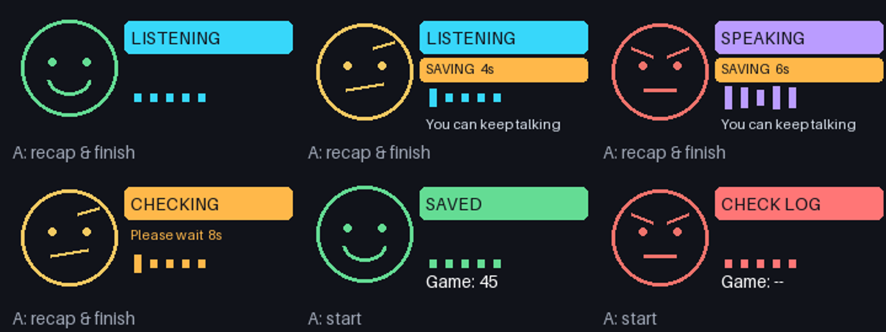

# Chatterboxes

**Collaborators:** Jiesen Huang （jh3263），Serena Tsai (ht534), Yuge Xu (yx692), Youzhu Jin (yj578), and Zijii Zhang (zz894).

> **Ziji Zhang.** I worked on the Lab 3 ideation and implementation, including the speech interaction, coach behavior. Codex assisted with coding, debugging, documentation, and visual materials; I contributed to the concept, feedback, and refinement of the interaction.

> **How to read this page:** my own responses are set in blockquotes like this
> one, to separate them from the original assignment text.

[](https://youtu.be/LZ0VJClIlRI?si=Yy84mcyVYuVV19mn)

In this lab, we want you to design interaction with a speech-enabled device — something that listens and talks to you. This device can do anything *but* control lights (since we already did that in Lab 1). First, we want you to storyboard what you imagine the conversational interaction to be like. Then you will use wizarding techniques to elicit examples of what people might say, ask, or respond. We then want you to use the examples collected from at least two other people to inform the redesign of the device.

We will focus on **audio** as the main modality for interaction to start; these general techniques can be extended to **video**, **haptics** or other interactive mechanisms in the second part of the Lab.

A note on what you are building with. Speech interfaces are usually taught as two boxes — speech-in, speech-out — and that framing hides the part that actually determines whether an interaction works. Between listening and speaking sits the question of **whose turn it is**: when does the device decide you have finished talking, and how long does it make you wait before it answers? This lab gives you direct control over both, and we will ask you to notice what changes when you move them.

## Prep for Part 1: Get the Latest Content and Pick up Additional Parts

Please check instructions in [prep.md](prep.md) and complete the setup.

### Pick up Web Camera If You Don't Have One

Students who have not already received a web camera will receive their Webcam and at the beginning of lab. If you cannot make it to class this week, please contact the TAs to ensure you get these.

### Get the Latest Content

As always, pull updates from the class Interactive-Lab-Hub to both your Pi and your own GitHub repo.

**\[recommended\]** Option 1: On the Pi, `cd` to your `Interactive-Lab-Hub`, pull the updates from upstream (class lab-hub) and push the updates back to your own GitHub repo. You will need the *personal access token* for this.

```
pi@ixe00:~$ cd Interactive-Lab-Hub
pi@ixe00:~/Interactive-Lab-Hub $ git pull upstream Fall2026
pi@ixe00:~/Interactive-Lab-Hub $ git add .
pi@ixe00:~/Interactive-Lab-Hub $ git commit -m "get lab3 updates"
pi@ixe00:~/Interactive-Lab-Hub $ git push
```

Option 2: On your own GitHub repo, create a pull request to get updates from the class Interactive-Lab-Hub. After you have the latest updates online, go to your Pi, `cd` to your `Interactive-Lab-Hub` and use `git pull`.

---

# Part 1

## Setup

Create and activate a virtual environment for this lab:

```
pi@ixe00:~$ cd Interactive-Lab-Hub/Lab\ 3
pi@ixe00:~/Interactive-Lab-Hub/Lab 3 $ python3 -m venv .venv
pi@ixe00:~/Interactive-Lab-Hub/Lab 3 $ source .venv/bin/activate
(.venv) pi@ixe00:~/Interactive-Lab-Hub/Lab 3 $
```

Install the Python dependencies:

```
(.venv) $ pip install -r requirements.txt
```

This takes a few minutes. If you would like it to take considerably less time, [`uv`](https://docs.astral.sh/uv/) is a drop-in replacement for `pip` that is dramatically faster on the Pi:

```
(.venv) $ pip install uv && uv pip install -r requirements.txt
```

Then run the setup script, which installs the classic speech synthesizers, downloads the voice activity detection model, and pre-fetches a neural voice and a speech recognition model so you are not waiting on downloads during lab:

```
(.venv):~$ cd speech-scripts
(.venv) $ ./setup.sh
```

Check your audio devices before going further. `arecord -l` lists capture devices and `aplay -l` lists playback devices; if your webcam microphone or Bluetooth speaker does not appear, fix that first — every script below assumes the system defaults are the ones you want.

> **My setup (September 23):** Orange detected the USB PnP microphone and the
> UACDemoV1.0 USB speaker without an additional device driver. A three-second
> recording through the default input contained an audio signal. Playback only
> became audible after I raised the USB speaker's PCM volume from 40% to 70%;
> I then heard a test WAV through the USB speaker. I installed the Lab 3
> packages in `Lab 3/.venv`, separate from the Pi's boot-display environment.

> **Quick speaker volume control:** run `speech-scripts/volume.sh` on Orange,
> or from this Lab's directory on my Mac (it connects through `ssh Orange`).
> No virtual environment is required. It controls the UACDemoV1.0 USB
> speaker's ALSA `PCM` mixer, so adjustment does not require restarting the
> speech program. It selects the speaker by card name rather than its USB
> card number, which can change after a reboot or reconnect.
>
> ```bash
> ./speech-scripts/volume.sh         # Show current volume and mute state
> ./speech-scripts/volume.sh 70      # Set 70% and unmute
> ./speech-scripts/volume.sh -5      # Lower by 5 percentage points
> ./speech-scripts/volume.sh +5      # Raise by 5 percentage points
> ./speech-scripts/volume.sh mute    # Silence without losing the setting
> ./speech-scripts/volume.sh unmute  # Restore sound at that setting
> ./speech-scripts/volume.sh ui      # Arrows: adjust; M: mute; Esc: exit
> ```
>
> I can keep the interactive mixer open in a second terminal during a demo.
> Numeric commands use `amixer`'s raw percentage scale; the interactive
> `alsamixer` panel uses a perceptual scale, so their displayed percentages
> can differ. Relative changes preserve mute state. This changes the current
> mixer setting; it does not configure a startup volume or the microphone gain.

## A. Text to Speech

Your Pi can speak in several quite different ways, and the differences are audible in a way that matters for design. In `speech-scripts/` there are shell scripts for each.

### The classic engines

```
(.venv) $ cd speech-scripts

(.venv) $ sudo apt update
(.venv) $ sudo apt install -y espeak festival festvox-kallpc16k

(.venv) $ ./espeak_demo.sh
(.venv) $ ./festival_demo.sh
```

You can run these `.sh` files by typing `./filename`, and read one with `cat filename`. You can also play audio files directly with `aplay filename` — try `aplay lookdave.wav`.

These are all decades-old technology and they sound like it. `espeak-ng` is a *formant synthesizer*: it generates speech from an acoustic model of the vocal tract, which is why it sounds robotic but also why the whole thing fits in a couple of megabytes and responds instantly. `festival` is *concatenative*: they stitch together recorded fragments of a real speaker, which sounds more human but breaks audibly at the seams.

### Neural TTS with Piper

Note that the Piper command line changed in version 1.x — voices are now downloaded explicitly with `python3 -m piper.download_voices`, and you invoke it as `python3 -m piper`. Tutorials you find online may show the old `echo ... | piper --model ...` form, which no longer works. Browse the [voice samples](https://rhasspy.github.io/piper-samples) and download a different one if you'd like:

```
(.venv) $ python3 -m piper.download_voices en_US-lessac-medium
```

[Piper](https://github.com/OHF-Voice/piper1-gpl) synthesizes speech with a small neural network, runs comfortably on the Pi 5, and sounds markedly better than the above.

```
(.venv) $ ./piper_demo.sh
```

The demo script also shows `--output-raw`, which streams audio to the speaker as it is generated rather than writing a file first. Listen for the difference in how quickly speech begins. In a conversational system this gap is the thing your user experiences as responsiveness.

\*\***Write your own shell file to use your favorite of these TTS engines to have your Pi greet you by name.**\*\*
(This shell file should be saved to your own repo for this lab.)

> I tried eSpeak, Festival, and Piper on Orange. I preferred Piper and wrote
> [greet_jiesen.sh](speech-scripts/greet_jiesen.sh), which uses Piper to say my
> name.

\*\***Then answer: Is the same greeting, in these different voices, the same greeting? Describe one concrete way the voice changed what the utterance seemed to mean or who seemed to be speaking.**\*\*

> The words alone do not carry the whole greeting. Piper sounded clearer and
> friendlier to me; it made the greeting feel more like it came from an
> approachable conversational device. The older voices felt less suited to that
> role.

## B. Speech to Text

We use [faster-whisper](https://github.com/SYSTRAN/faster-whisper), a reimplementation of OpenAI's Whisper model that runs several times faster on CPU and does not require PyTorch. All processing happens on the Pi; nothing is sent to a server.

```
(.venv) $ python transcribe.py lookdave.wav
```

The transcript is not the interesting output here — the timings are. Run it again with a larger model and compare:

```
(.venv) $ python transcribe.py lookdave.wav --model base.en
(.venv) $ python transcribe.py lookdave.wav --model small.en
#  noted that the first run may take longer because the model is downloaded, and that the HF unauthenticated-request warning is expected and not an error.
```

Available sizes, smallest first: `tiny.en`, `base.en`, `small.en`, `medium.en`. The `.en` variants are English-only and faster than their multilingual counterparts at the same size.

\*\***Record a few seconds of your own speech (`arecord -d 5 -f cd -c 1 -r 16000 test.wav`) and transcribe it with at least two model sizes. Report the real-time factor for each. At what point does the accuracy improvement stop being worth the delay, for a system that has to answer you?**\*\*

> I said **“I was testing”** into the USB microphone and compared both models
> on the same six-second recording. The transcription time excludes model
> loading, as the script reports it separately.
>
> | Model | Transcript | Transcription time | Real-time factor |
> | --- | --- | ---: | ---: |
> | `tiny.en` | “I was enjoying the” | 12.03 s | 2.00× |
> | `base.en` | “I was enjoying the trip.” | 11.23 s | 1.87× |
>
> Both transcripts were wrong. In this sample, the larger model added a word I
> did not say, so it provided no accuracy improvement to justify choosing it
> for this interaction. The slight timing advantage for `base.en` is from one
> run and does not establish that it is generally faster. Its first model load
> took 11.83 s versus 0.56 s for the already cached `tiny.en`; that initial
> comparison includes possible download time. A longer, more varied set of
> recordings would be needed before choosing a model. The original WAV remains
> local on Orange and is not committed.

\*\***Write your own script that verbally asks for a numerical input (a phone number, zipcode, number of pets) and records the answer the respondent provides.**\*\* Numbers are a good stress test — transcription systems make characteristic errors on digit strings, and you will want to know what they are before you design around them.

> My [ask_number.sh](speech-scripts/ask_number.sh) speaks a request for a
> made-up four-digit number with Piper, then records a six-second reply to
> `recordings/`. I said **0004**. A `tiny.en` transcription contained “zero,
> zero, zero, four,” but also inserted unrelated words before and after it.
> That makes confirmation important before using a digit string as data. The
> recorded reply stays local and is ignored by Git.

## C. Turn-taking: knowing when someone has stopped talking

Everything so far has worked on fixed audio files. A real conversational device does not get told when to start and stop recording — it has to decide. This is the problem that makes speech interfaces hard, and it is mostly not a speech recognition problem.

We use a **voice activity detector** (VAD) to segment the microphone stream into utterances. `listen.py` runs Silero VAD continuously and hands each detected utterance to faster-whisper:

```
(.venv) $ cd speech-scripts
(.venv) $ python listen.py
```

Speak, pause, and watch it transcribe. Now change the endpointing threshold — the amount of silence the system requires before it decides your turn is over:

```
(.venv) $ python listen.py --min-silence 0.2
(.venv) $ python listen.py --min-silence 1.5
```

\*\***Try both extremes, and something in between. Describe what each one feels like to talk to. Note specifically: at 0.2s, what kinds of normal speech get cut off? At 1.5s, what does the delay make the system seem like?**\*\*

> I tested `listen.py` on Orange at **0.2 s**, **0.8 s**, and **1.5 s** while
> speaking a sentence with a pause. At 0.2 s it printed one complete “I was
> testing the microphone today,” and I did not feel cut off in that attempt.
> At 0.8 s it printed two pieces; the second was mistranscribed. At 1.5 s it
> also printed two pieces. I preferred the middle setting overall, while the
> 1.5 s attempt still felt okay.
>
> These attempts used live speech, so my pauses were not precisely the same
> length. The logs therefore do not show that a higher threshold caused more
> splitting. A 0.2 s threshold risks treating an ordinary thinking pause as
> the end of a turn, although I did not observe that failure in this attempt.
> A 1.5 s threshold necessarily waits longer after a turn and could make a
> device seem hesitant; I did not find this particular attempt unpleasant. For
> a prototype, I would start at 0.8 s and test it again with the intended
> dialogue.

There is no correct value. A system that takes drink orders and a system that listens to someone think out loud want very different thresholds, and the right one depends on what your users are doing with their pauses.

### The complete loop

`echo_bot.py` puts the pieces together: it listens, endpoints, transcribes, and speaks a reply through Piper. The dialogue policy is deliberately trivial — it repeats what you said — so that everything you notice is a property of the timing rather than the content.

```
(.venv) $ python echo_bot.py
```

> I ran the complete loop with `--min-silence 0.8`. I said “I am also
> listening”; the bot recognized it correctly and spoke back “You said: I am
> also listening.” It measured 1.06 s for transcription and 0.27 s until
> Piper's first audio, for a 1.34 s gap **after** VAD ended the turn. The
> perceived wait also includes the endpointing silence before that measurement
> begins.

> ### Why I plan to use GPT-Live for the next prototype
>
> Part 1's local Piper, faster-whisper, and VAD loop helped me see how voice,
> recognition, and endpointing each affect a conversation. For the next version
> of our food-roasting device, I chose [GPT-Live](https://developers.openai.com/api/docs/guides/live)
> mainly for its **full-duplex** speech: someone can add another dish or interrupt
> a roast while the agent is speaking. That flexibility matters to the comic
> timing of a back-and-forth exchange.
>
> Our idea may later need **tool calls**, such as looking up a dish, and
> **image recognition** if someone shows the device their food instead of only
> describing it. GPT-Live can [delegate tool work to a backend](https://developers.openai.com/api/docs/guides/live-delegation),
> but [the voice model itself does not accept images](https://developers.openai.com/api/docs/models/gpt-live-1).
> We would need to send a photo to a separate vision-capable backend and pass a
> concise result back into the spoken conversation. Neither tool use nor image
> recognition is part of the current prototype.
>
> In a small test on Orange, I used the upper physical button to start and stop
> a GPT-Live session. I told the agent about cake, broccoli, and Haagen-Dazs in
> successive turns; it transcribed those foods and spoke a roast for each one.
> The first playback was too quiet, so I raised the USB speaker's PCM volume
> from 70% to 100% and confirmed that a test sound was loud enough. This test
> shows that the basic voice interaction and button control work on our device;
> it does not yet measure interruption timing or show that the planned backend
> features work.

## D. Storyboard

Storyboard and/or use a Verplank diagram to design a speech-enabled device. (Stuck? Make a device that talks for dogs. If that is too stupid, find an application that is better than that.)

\*\***Post your storyboard and diagram here.**\*\*

> 
>
> [Open the storyboard HTML](storyboard-roast-coach.html) (the PNG above is the report version).
>
> **Concept and process.** We first mapped the idea with Verplank's eight prompts: **Idea/Error:** turn an ordinary food log into an entertaining conversation whose feedback is easier to notice; **Metaphor/Scenario:** a demanding but funny coach hears a person's day of eating; **Model/Task:** the person presses the top button, reports foods in sequence, and understands that the coach's mood responds to the day's reported context; **Display/Control:** spoken praise or a roast is paired with one animated face on Orange's screen, and the same button ends the session. We reduced that into six beats: check in, broccoli, cake, interruption with fried chicken, a held stare, and a punchline. The last two beats leave space for a reaction shot when filming.
>
> This is a **proposed interaction**, not a completed calorie tracker. The coach remembers the foods reported in this check-in and uses tentative calorie context to change its tone; it would ask about portions before making a numeric claim. The face shows the coach's reaction: green smiles and bounces, yellow raises an eyebrow, and red glares before a stronger roast. A future app-side function could receive mood, expression, and motion cues and render the face in step with the voice, using a local function or MCP-backed tool. The color is not a measured calorie total. For Part 1, speech remains primary; the screen is a direction for Part 2.
>
> **Storyboarding revision.** The first image made the fried-chicken turn look like another ordinary report. We redrew it as a user interruption, then removed sound marks from the red face's silent stare. The small grey wave below each frame now shows the turn: toward the device means listening, toward the user means the coach speaks, the slashed wave means interruption, and the flat line means silence. Color still shows only the coach's mood. We need to test whether someone can read that change without this explanation and whether the pause works when acted out.

Write out what you imagine the dialogue to be. Use cards, post-its, or whatever method helps you develop alternatives or group responses.

\*\***Please describe and document your process.**\*\*

Your script should include the pauses. Where does your device wait, and for how long? You now know from Part C that this is a parameter you have to choose, not something that happens for free.

> **Proposed performance script (English).** One person plays the user; the designer voices the coach and changes a face card or prepared screen image at each cue. The face cues make this possible to rehearse and film before the display is implemented.
>
> 1. **Start — neutral, listening face.** *The user presses the top button. The face wakes up.* **Coach:** “Check-in time. What did you eat today?”
> 2. **Broccoli — green, bouncing smile.** **User:** “Broccoli.” *The coach waits about 0.4 s after the user finishes. Bob the green face twice.* **Coach, pleased:** “Broccoli? Excellent. The nutrition department is finally open for business.”
> 3. **Cake — yellow, raised eyebrow.** **User:** “And a slice of cake.” *The face changes to yellow. Hold the eyebrow for about 0.5 s.* **Coach, dryly:** “Cake. The broccoli was about to get a glowing review, but—”
> 4. **Interruption — red, angry face.** *The user cuts in on the dash, before the coach finishes the thought.* **User:** “And fried chicken.” *The coach stops speaking immediately. The red face holds a silent stare for about 1 s.*
> 5. **Punchline — red face shifts to a crooked smirk.** **Coach, stern but playful:** “Fried chicken too? Broccoli was Employee of the Month. Cake and fried chicken just bought the company. At dinner, the fryer is fired.”
> 6. **End — face off.** *The user laughs, says “Okay, fair,” and presses the top button to end the check-in. The face goes dark.*
>
> The 0.4 s response wait, 0.5 s eyebrow hold, and 1 s silent stare are **staging targets for the video**, not measured device timing. We would tune them after acting out the exchange.
>
> The joke escalates with the food sequence and the face's timing. The roast addresses the menu and choices, not the person's body. If the user corrects a food, interrupts, or asks for a gentler tone, the coach should listen and adjust. This response rule and the synchronized face are design intentions; the current Orange prototype has only verified button-controlled voice conversation, without the mood display or food-log tool.

## E. Acting out the dialogue

Find a partner, and *without sharing the script with your partner* try out the dialogue you've designed, where you (as the device designer) act as the device you are designing. Please record this interaction (for example, using Zoom's record feature).

\*\***Describe if the dialogue seemed different than what you imagined when it was acted out, and how.**\*\*

> **Acted-out dialogue (56 seconds).** We used food-image props to act out the conversation; this video shows the interaction idea, not the Orange prototype.
>
> https://github.com/user-attachments/assets/eac24de0-004f-481f-9eeb-363cdf2a0f6e
>
> _[Watch or download the MP4](assets/video/part-e-acting-2026-09-27.mp4) · 56 seconds_
>
> **Reflection.** Acting it out revealed an unclear ending: the user may still want to know how the day went. In the next version, a tool call would pass each food report to the front end to update a provisional daily score in the backend. Pressing the end button would trigger the coach's score summary before the session closes. This is a design proposal, not a tested feature.


---

# Lab 3 Part 2

For Part 2, you will redesign the interaction with the speech-enabled device using the data collected, as well as feedback from part 1.

> **Version note.** This section separates the earlier demonstration and three-user video tests from the **September 30 revision**. The videos were recorded before that revision. Its implementation and automated results are documented below, but it has not yet had a new participant test.

## Prep for Part 2

1. What are concrete things that could use improvement in the design of your device? For example: wording, timing, anticipation of misunderstandings.
2. What are other modes of interaction *beyond speech* that you might also use to clarify how to interact? In particular: how does someone know when the device is listening, and when it is thinking? You have a screen and an LED.
3. Make a new storyboard, diagram and/or script based on these reflections.
4. (optional) Integrate [input devices](inputs.md) in the system

> **From the acted dialogue to the revised design.** The Part 1 exercise exposed an unclear ending: a final joke did not tell the user what had been recorded or how the check-in went. The first working prototype added a saved food record, a fixed menu-game score and a spoken recap. Its rehearsed food sequence remains documented in the September 27 video below.
>
> The three-user tests were conducted **before the September 30 changes**. Together with my own trials, they pointed to three different gaps: finding the start control, knowing what to say after activation, and understanding a wait. I also wanted the coach to sound supportive and sharply opinionated without delivering a canned script. The revised design addresses these problems as follows:
>
> | Observation | Design response in the September 30 version | What still needs checking |
> | --- | --- | --- |
> | A new user was unsure how to start. | Keep the ready-screen `A: start` cue and the same upper A button for start/finish. | The label already existed; a clearer physical button label or onboarding treatment still needs testing. A greeting after activation cannot solve finding the button. |
> | After activation, a user did not know what to say. | The coach opens in English and invites a food report before the user speaks. | Whether a new user understands the invitation and gives enough information. |
> | A processing delay looked like a freeze. | Use distinct activity colors, a separate SAVING label with elapsed time, and a short processing tone when speech is not playing. | Whether people notice the cues and understand that they can keep talking during background saving. |
> | My trials sometimes sounded mechanical or repeated a food-specific routine. | Keep encouragement and strong menu jokes, but remove the named-food storyline from the prompts. Use only the user's actual reports for callbacks. | Whether the humor feels supportive across different people and menus. |
>
> **Revised interaction script — September 30.** This describes the implemented flow, not a transcript or a required sequence of foods. The broccoli → cake → fried chicken sequence is now a demonstration case, not an instruction for every conversation.
>
> | Beat | User / control | Coach and display |
> | --- | --- | --- |
> | Start | Press the upper A button. | Connect, then open with: “Hey, I'm Orange. What have you eaten today? Give me the menu; I'll bring the attitude.” |
> | Report | Name a food and the amount eaten. | Respond with specific encouragement or a menu-focused joke. Ask about a genuinely missing portion without reciting a bookkeeping receipt. |
> | Continue | Add another food while the record is being updated. | Keep listening and speaking available. Show cyan LISTENING or violet SPEAKING, with amber SAVING alongside it and “You can keep talking.” |
> | Correct | Clarify an amount, retract a food, or interrupt the coach. | Reuse the saved entry for corrections. The voice is instructed to yield and drop jokes based on a retracted claim; natural interruption still needs a fresh human test. |
> | Finish | Press A again. | Stop microphone capture, check the record, then speak the saved food recap, score and humorous sign-off. Show CHECKING/RECAP while waiting and playing. |
>
> **Timing choices.** About 1.2 seconds without a new user transcript fragment schedules background bookkeeping; this is not proof that a sentence has ended. Later fragments can correct the same entry. Processing lasting more than 1.2 seconds can trigger one short tone, with the tone suppressed during speech and at least five seconds between cues. These are separate timers, not the staged one-second stare from Part 1. The stare is not implemented. The screen supplies the additional modality; a separate LED and optional camera-based food recognition remain unimplemented.

## Prototype your system

The system should:
* use the Raspberry Pi
* use one or more sensors
* require participants to speak to it

*Document how the system works.*

*Include videos or screencaptures of both the system and the controller.*

> **Current prototype — September 30 revision.** Orange uses a USB microphone, external speaker, upper A button and small screen. GPT-Live handles the English conversation; a delegated Responses model interprets food reports and requests `get_food_log` or `log_food`. Python owns the record and calculates the score. The conversation does not depend on the voice character remembering to announce or perform every save: the application schedules background updates after transcript pauses.
>
> **Conversation and bookkeeping.** Capture and playback run concurrently during conversation. However, the earlier client's audio receiver also waited for tool processing/result transmission and synchronously wrote audio and screen state. Those were local blocking paths even though the transport supported full duplex. The revision puts playback and tool handling on separate ordered workers and moves file writes away from the audio loop. It also records timing diagnostics. This removes specific coupling between tasks; it does not prove that every earlier pause came from a tool call or that the network can never stall.
>
> **A clear ending.** Pressing A again intentionally stops capture. The application reconciles and freezes the food record, creates a recap, synthesizes it, and waits for the player to finish before closing Live. Failed reconciliation or unconfirmed playback is recorded as such. Each check-in has a separate private record; it is not a cumulative daily total. The ending still uses a category-based recap template, so removing the conversation's scripted food examples does not make every closing joke unique.
>
> **Fixed, inspectable scoring: `menu-game-v1`.** The score is a fictional menu game, not a calorie estimate or nutritional assessment. Its weights are design choices. The executable rubric is the single source of the numeric rules, and each result saves the calculation breakdown.
>
> | Category | Points per entry with a stated portion |
> | --- | ---: |
> | Vegetable or fruit | +10 |
> | Protein or staple | +5 |
> | Dessert | −5 |
> | Fried food | −10 |
> | Other or mixed/unclear dish | 0 |
>
> Start at 50, cap each category's contribution at ±20, and clamp the total to 0–100. Unknown portions stay pending and add no points; if all portions are unknown, there is no score. A stated count of a whole food qualifies as a portion. Quantities are stored but do not multiply the points. The revision rejects model-supplied score fields and strengthens duplicate, correction and removed-ID checks. The same saved entries therefore produce the same score. Identifying the food, interpreting a correction and assigning its initial category still depend on the model and can be wrong. See the [full rubric and limits](COACH_RUBRIC.md).
>
> **State feedback without narrating the machinery.** The face retains the comic mood colors. Separate, prominent labels show cyan LISTENING, violet SPEAKING/RECAP and amber SAVING/CHECKING, with words as well as color. Saving can appear alongside listening or speaking because it does not require the user to stop. Elapsed seconds explain a wait without pretending to know a completion percentage. A brief two-note processing cue uses the same audio player and waits for a gap in speech. Silent audio packets are not treated as evidence that the coach is speaking.
>
> **Revised screen preview — September 30.** These are frames generated by the renderer, not photographs or evidence of participant comprehension. The [earlier renderer preview](test-evidence/food-coach-render-preview.png) is retained for comparison.
>
> 
>
> **Implementation:** [Food coach and run instructions](FOOD_COACH.md) · [Ledger and rubric](speech-scripts/food_coach.py) · [Live client](speech-scripts/roast_master_live.py) · [Button controller](speech-scripts/roast_button.py) · [Prompt audit](PROMPT_AUDIT.md).
>
> **Earlier device demonstration — before the September 30 revision (2026-09-27).** This 1:47 recording shows the working Raspberry Pi, its button/screen controller and the external speaker during one rehearsed check-in. I report broccoli, clarify it as a bowl, then add two slices of chocolate fudge cake and fried chicken. The coach asks about the broccoli portion, moves from encouragement to jokes that recall the earlier foods, and finishes with the three food names, **45 points** and a humorous sign-off. The display changes from green to yellow to red and shows the recap at the end.
>
> https://github.com/user-attachments/assets/35731f0c-e4a3-4d94-a3dc-0379ecad81d9
>
> [Watch or download the complete demonstration](assets/video/part2-food-coach-demo-2026-09-27.mp4) · 1:47 · original timing and audio retained.
>
> | Approximate time | What to look for |
> | --- | --- |
> | 0:00–0:29 | Broccoli report, portion question, clarification and encouragement. |
> | 0:29–0:52 | Chocolate fudge cake and two slices; the joke refers back to the broccoli. |
> | 0:52–1:21 | Fried chicken and a stronger, contextual roast; the face turns red. |
> | 1:21–1:47 | Transition to the ending, food recap, 45-point result and humorous sign-off. |
>
> This video documents the earlier rehearsed path. It does **not** show the later automatic greeting, revised activity labels, processing tone or audio-worker changes, and it is separate from the three-user study. It does not independently verify the saved JSON record, every correction/interruption case, or the return to idle after playback; those require separate checks. The original MOV is preserved locally, and the MP4 is a portrait H.264/SDR copy for web playback.
>
> **Author trials and later engineering checks.** In my first button-and-microphone trial, the record/playback loop completed, but the coach felt mechanical. A later trial restored encouragement and sharper jokes; it also exposed missed bookkeeping and a formal-sounding ending. Background logging and a shorter recap addressed those implementation problems. The subsequent prompt audit removed the prescribed food storyline while retaining a supportive, judgemental character. These are my development observations, separate from my friend's participant feedback below.
>
> **September 30 automated verification, after the video tests:**
>
> - All **73 offline tests** passed on both Mac and Orange, including duplicate/correction rules, scoring, slow-tool and blocked-playback fault injection, state cues and opening requests.
> - In successful real API tests, non-silent opening speech arrived about **2.1–3.5 seconds after the greeting request**, before user speech. That timing starts after connection; it is not total button-to-greeting latency. An earlier verbose opening request was acknowledged but stayed silent in its six-second observation window, so acknowledgment alone was not accepted as success.
> - Synthetic speech produced ongoing scores of **60 → 55 → 45** for the demonstration menu, with a portion correction and no duplicate entry. An alternative apple/rice/ice-cream test produced **60 → 65 → 60**; its coach transcript and recap did not introduce the old scripted foods. An initial whole-food count was incorrectly left pending, which led to clearer portion instructions and a regression check before the successful rerun.
> - Non-silent output continued during backend work, and the tested endings completed record reconciliation, player exit and session closure. These tests used the silent ALSA `null` output, not a listener judging the physical speaker.
>
> The revised controller was deployed and reached READY on Orange. One API run still had an approximately **1.26-second audio receive gap**, so I cannot claim that all audio discontinuities are gone. Physical speaker continuity, acoustic feedback, cue audibility, interruption quality and screen readability need a new human session. Details are in the [September 30 test record](AUDIO_VERIFICATION_2026-09-30.md); the [September 27 record](test-evidence/food-coach-2026-09-27.md) documents the earlier iteration. **The participant videos below are not a retest of the revision.**
>
> **AI assistance.** Codex assisted with the ledger, audio/API integration, button controller, screen rendering, prompts, automated tests and this report. GPT-Live generates the conversation, the delegated model interprets food reports, and TTS speaks the application-prepared recap; application code computes the score. The three-user observations below are adapted from my friend's written feedback, not generated test participants or new observations from the automated runs.

## Test the system

Try to get at least two people to interact with your system. (Ideally, you would inform them that there is a wizard *after* the interaction, but we recognize that can be hard.)

Answer the following:

> **Three-user testing — before the September 30 changes.** We tested the earlier system with three users. The observations below are adapted from my friend's written feedback. These recordings document the problems that still needed attention at that stage; they do not demonstrate the revised greeting, cues or audio architecture. They are linked in the order supplied, without assuming that recording numbers correspond to User 1–3. The author demonstration above and the later automated checks are separate evidence.
>
> | Recording | Test video |
> | --- | --- |
> | 1 | [Watch Recording 1 — IMG_2993.MOV](https://drive.google.com/file/d/1QumG519KZk4dyWR9hm_BJX6LHlwHpFQJ/view?usp=sharing) |
> | 2 | [Watch Recording 2 — IMG_2991 2.MOV](https://drive.google.com/file/d/1u61GTxf0ozHFllubN2CocLazCqHkdldY/view?usp=sharing) |
> | 3 | [Watch Recording 3 — IMG_2987 2.MOV](https://drive.google.com/file/d/1lLDcYg3TR6D0aUHv-P-L6SUNnn3UEdpF/view?usp=sharing) |

> ### User 1

> User 1 was not familiar with the physical button and was initially unsure how to start. This points to an onboarding problem before conversation even begins. The current `A: start` label cannot be assumed sufficient just because it exists. A more noticeable label tied to the physical button is still a design task; the new spoken greeting only helps after activation.

> ### User 2

> User 2 could start the system but was unsure what to do next. The device did not make the expected input clear enough. The later automatic opening now invites a food report, after which the coach can ask about missing portions. The API tests confirm that it can speak first; they do not yet show that this user-facing confusion has been resolved.

> ### User 3

> User 3 noticed that the system sometimes felt slow. After submitting their food information, they waited for feedback and thought the system had frozen. My friend described this as a wait during score calculation. From the user's perspective, the processing state was not apparent, so the delay looked like a failure. The ending involves record reconciliation and speech preparation as well as score calculation; without timing logs tied to this test, we cannot attribute the entire wait to the calculation itself.

### What worked well about the system and what didn't?

> The basic interaction worked: according to the test feedback, all three users were able to interact with the device using speech and eventually complete the food-reporting flow. Once users understood what to do, speech was a natural input method.
>
> The main problems were onboarding, prompting and system-state visibility. User 1 did not immediately understand how to use the button. User 2 did not know what to say after the system started. User 3 interpreted the processing delay as the system freezing. Together, these observations show that successful completion alone is not enough: the device must also make the next action and the reason for waiting understandable.
>
> The earlier scripted demonstration showed the intended encouragement, contextual jokes and final recap. The three-user feedback adds evidence about usability, but does not establish whether users found the humor supportive or understood the arbitrary menu-game score. Those questions need explicit follow-up.

### What worked well about the controller and what didn't?

> The physical controller gives the interaction a concrete start and finish: the upper A button starts a check-in, and another press requests the final recap. Its screen can show the coach's expression and a separate activity label while we observe how users respond to the flow. In this implementation, the application and voice model generate responses; the button controller is not a human wizard manually choosing each reply.
>
> The tests exposed weaknesses in how that control was communicated. User 1 did not know how to start, and User 3 did not perceive a clear processing cue. Although the earlier prototype had activity labels, their presence was insufficient to explain the wait. The revision makes saving a separate colored label with elapsed time and adds a short tone instead of making the character repeatedly announce “I am saving.” This preserves room for conversation, but a visible start instruction still has to be connected clearly to the physical button.
>
> The controller also needs to distinguish “saving while you can continue” from “finishing, please wait.” Those states now appear differently. A human retest must check whether the words, colors and sound communicate that distinction on the small physical screen, especially while the user is listening to a joke.

### What lessons can you take away from the WoZ interactions for designing a more autonomous version of the system?

> The acting/WoZ exercise and subsequent prototype tests showed that the system should not assume users already know how to interact with it. User 1's experience points to onboarding before activation. User 2's experience points to a clear spoken prompt immediately afterward. User 3's experience points to a perceptible processing state whenever the device cannot reply promptly.
>
> The autonomous version has to expose both the next action and its current availability. A face can express attitude without explaining whether input is still accepted. The revised state labels therefore sit alongside the mood face, and background saving does not take over the conversation. Similarly, the old acted food sequence is useful for rehearsal but should not become a rule that makes the model invent the same foods in every check-in.
>
> A human wizard can remember the food list, clarify a portion and choose when to finish. Our application now owns the food record, correction rules, numerical score and finishing sequence, while the voice model handles the character and wording. Earlier missed logging showed why a convincing spoken response is not evidence that the underlying task was completed. Future trials should include a correction, an interruption and an early end press alongside the normal flow.
>
> Latency is both a technical and an interaction-design issue. Unexplained silence can make a working system appear broken. A clearer cue can explain a necessary wait, but we should also measure and reduce the wait itself, and provide an explicit error or recovery message if processing fails.

### How could you use your system to create a dataset of interaction? What other sensing modalities would make sense to capture?

> With participants' agreement, we could log interactions as timestamped sequences of spoken food reports, transcripts, button presses, interface states, system responses, ledger changes, score results and response latency. The application already keeps a private per-check-in record of foods, portions, tool-call history, rubric calculations and final recap status, plus timing diagnostics. It does not retain raw microphone recordings. A bounded text-transcript trace is available for opt-in diagnostics and was used for synthetic testing; it is off in normal controller sessions. A study dataset would require additional event logging and consented collection, rather than assuming the existing records capture the whole interaction.
>
> The three tests suggest useful measures: time from seeing the ready device to pressing A, time from activation or the opening prompt to the first food report, and time spent waiting before repeating speech or pressing the button again. Pairing each food report with its ledger change and coach response would also reveal cases where the conversation sounds correct but the saved record is wrong.
>
> Button-event logging and screen-state logging would connect user actions to what the interface was showing. A consented camera recording of the participant and device could help annotate hesitation, gaze toward the screen or reactions during pauses; confusion should be established through observation and follow-up questions, not inferred automatically from a face. A separate camera input for food recognition could supply food and portion suggestions, which the user would confirm before they enter the record. Neither camera recognition nor this expanded participant dataset has been implemented.

<details>
  <summary><strong>Submission Cleanup Reminder (Click to Expand)</strong></summary>

  **Before submitting your README.md:**
  - This readme.md file has a lot of extra text for guidance.
  - Remove all instructional text and example prompts from this file.
  - You may either delete these sections or use the toggle/hide feature in VS Code to collapse them for a cleaner look.
  - Your final submission should be neat, focused on your own work, and easy to read for grading.
</details>
