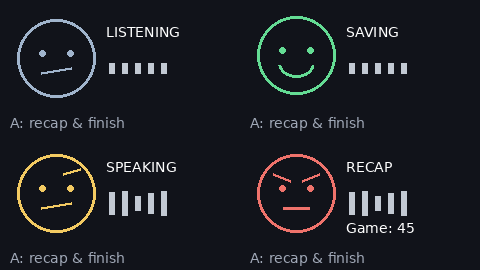

# Chatterboxes

**NAMES OF COLLABORATORS HERE**

> **Ziji.** I worked on the Lab 3 implementation and testing, including the speech interaction, coach behavior, and overall integration. Codex assisted with coding, debugging, documentation, and visual materials; I contributed to the concept, testing, feedback, and refinement of the final interaction.


> **How to read this page:** my own responses are set in blockquotes like this
> one, to separate them from the original assignment text.

[](https://youtu.be/LZ0VJClIlRI?si=Yy84mcyVYuVV19mn)

In this lab, we want you to design interaction with a speech-enabled device — something that listens and talks to you. This device can do anything *but* control lights (since we already did that in Lab 1). First, we want you to storyboard what you imagine the conversational interaction to be like. Then you will use wizarding techniques to elicit examples of what people might say, ask, or respond. We then want you to use the examples collected from at least two other people to inform the redesign of the device.

We will focus on **audio** as the main modality for interaction to start; these general techniques can be extended to **video**, **haptics** or other interactive mechanisms in the second part of the Lab.

A note on what you are building with. Speech interfaces are usually taught as two boxes — speech-in, speech-out — and that framing hides the part that actually determines whether an interaction works. Between listening and speaking sits the question of **whose turn it is**: when does the device decide you have finished talking, and how long does it make you wait before it answers? This lab gives you direct control over both, and we will ask you to notice what changes when you move them.

## Prep for Part 1: Get the Latest Content and Pick up Additional Parts

Please check instructions in [prep.md](prep.md) and complete the setup.

### Pick up Web Camera If You Don't Have One

Students who have not already received a web camera will receive their Webcam and at the beginning of lab. If you cannot make it to class this week, please contact the TAs to ensure you get these.

### Get the Latest Content

As always, pull updates from the class Interactive-Lab-Hub to both your Pi and your own GitHub repo.

**\[recommended\]** Option 1: On the Pi, `cd` to your `Interactive-Lab-Hub`, pull the updates from upstream (class lab-hub) and push the updates back to your own GitHub repo. You will need the *personal access token* for this.

```
pi@ixe00:~$ cd Interactive-Lab-Hub
pi@ixe00:~/Interactive-Lab-Hub $ git pull upstream Fall2026
pi@ixe00:~/Interactive-Lab-Hub $ git add .
pi@ixe00:~/Interactive-Lab-Hub $ git commit -m "get lab3 updates"
pi@ixe00:~/Interactive-Lab-Hub $ git push
```

Option 2: On your own GitHub repo, create a pull request to get updates from the class Interactive-Lab-Hub. After you have the latest updates online, go to your Pi, `cd` to your `Interactive-Lab-Hub` and use `git pull`.

---

# Part 1

## Setup

Create and activate a virtual environment for this lab:

```
pi@ixe00:~$ cd Interactive-Lab-Hub/Lab\ 3
pi@ixe00:~/Interactive-Lab-Hub/Lab 3 $ python3 -m venv .venv
pi@ixe00:~/Interactive-Lab-Hub/Lab 3 $ source .venv/bin/activate
(.venv) pi@ixe00:~/Interactive-Lab-Hub/Lab 3 $
```

Install the Python dependencies:

```
(.venv) $ pip install -r requirements.txt
```

This takes a few minutes. If you would like it to take considerably less time, [`uv`](https://docs.astral.sh/uv/) is a drop-in replacement for `pip` that is dramatically faster on the Pi:

```
(.venv) $ pip install uv && uv pip install -r requirements.txt
```

Then run the setup script, which installs the classic speech synthesizers, downloads the voice activity detection model, and pre-fetches a neural voice and a speech recognition model so you are not waiting on downloads during lab:

```
(.venv):~$ cd speech-scripts
(.venv) $ ./setup.sh
```

Check your audio devices before going further. `arecord -l` lists capture devices and `aplay -l` lists playback devices; if your webcam microphone or Bluetooth speaker does not appear, fix that first — every script below assumes the system defaults are the ones you want.

> **My setup (September 23):** Orange detected the USB PnP microphone and the
> UACDemoV1.0 USB speaker without an additional device driver. A three-second
> recording through the default input contained an audio signal. Playback only
> became audible after I raised the USB speaker's PCM volume from 40% to 70%;
> I then heard a test WAV through the USB speaker. I installed the Lab 3
> packages in `Lab 3/.venv`, separate from the Pi's boot-display environment.

## A. Text to Speech

Your Pi can speak in several quite different ways, and the differences are audible in a way that matters for design. In `speech-scripts/` there are shell scripts for each.

### The classic engines

```
(.venv) $ cd speech-scripts

(.venv) $ sudo apt update
(.venv) $ sudo apt install -y espeak festival festvox-kallpc16k

(.venv) $ ./espeak_demo.sh
(.venv) $ ./festival_demo.sh
```

You can run these `.sh` files by typing `./filename`, and read one with `cat filename`. You can also play audio files directly with `aplay filename` — try `aplay lookdave.wav`.

These are all decades-old technology and they sound like it. `espeak-ng` is a *formant synthesizer*: it generates speech from an acoustic model of the vocal tract, which is why it sounds robotic but also why the whole thing fits in a couple of megabytes and responds instantly. `festival` is *concatenative*: they stitch together recorded fragments of a real speaker, which sounds more human but breaks audibly at the seams.

### Neural TTS with Piper

Note that the Piper command line changed in version 1.x — voices are now downloaded explicitly with `python3 -m piper.download_voices`, and you invoke it as `python3 -m piper`. Tutorials you find online may show the old `echo ... | piper --model ...` form, which no longer works. Browse the [voice samples](https://rhasspy.github.io/piper-samples) and download a different one if you'd like:

```
(.venv) $ python3 -m piper.download_voices en_US-lessac-medium
```

[Piper](https://github.com/OHF-Voice/piper1-gpl) synthesizes speech with a small neural network, runs comfortably on the Pi 5, and sounds markedly better than the above.

```
(.venv) $ ./piper_demo.sh
```

The demo script also shows `--output-raw`, which streams audio to the speaker as it is generated rather than writing a file first. Listen for the difference in how quickly speech begins. In a conversational system this gap is the thing your user experiences as responsiveness.

\*\***Write your own shell file to use your favorite of these TTS engines to have your Pi greet you by name.**\*\*
(This shell file should be saved to your own repo for this lab.)

> I tried eSpeak, Festival, and Piper on Orange. I preferred Piper and wrote
> [greet_jiesen.sh](speech-scripts/greet_jiesen.sh), which uses Piper to say my
> name.

\*\***Then answer: Is the same greeting, in these different voices, the same greeting? Describe one concrete way the voice changed what the utterance seemed to mean or who seemed to be speaking.**\*\*

> The words alone do not carry the whole greeting. Piper sounded clearer and
> friendlier to me; it made the greeting feel more like it came from an
> approachable conversational device. The older voices felt less suited to that
> role.

## B. Speech to Text

We use [faster-whisper](https://github.com/SYSTRAN/faster-whisper), a reimplementation of OpenAI's Whisper model that runs several times faster on CPU and does not require PyTorch. All processing happens on the Pi; nothing is sent to a server.

```
(.venv) $ python transcribe.py lookdave.wav
```

The transcript is not the interesting output here — the timings are. Run it again with a larger model and compare:

```
(.venv) $ python transcribe.py lookdave.wav --model base.en
(.venv) $ python transcribe.py lookdave.wav --model small.en
#  noted that the first run may take longer because the model is downloaded, and that the HF unauthenticated-request warning is expected and not an error.
```

Available sizes, smallest first: `tiny.en`, `base.en`, `small.en`, `medium.en`. The `.en` variants are English-only and faster than their multilingual counterparts at the same size.

\*\***Record a few seconds of your own speech (`arecord -d 5 -f cd -c 1 -r 16000 test.wav`) and transcribe it with at least two model sizes. Report the real-time factor for each. At what point does the accuracy improvement stop being worth the delay, for a system that has to answer you?**\*\*

> I said **“I was testing”** into the USB microphone and compared both models
> on the same six-second recording. The transcription time excludes model
> loading, as the script reports it separately.
>
> | Model | Transcript | Transcription time | Real-time factor |
> | --- | --- | ---: | ---: |
> | `tiny.en` | “I was enjoying the” | 12.03 s | 2.00× |
> | `base.en` | “I was enjoying the trip.” | 11.23 s | 1.87× |
>
> Both transcripts were wrong. In this sample, the larger model added a word I
> did not say, so it provided no accuracy improvement to justify choosing it
> for this interaction. The slight timing advantage for `base.en` is from one
> run and does not establish that it is generally faster. Its first model load
> took 11.83 s versus 0.56 s for the already cached `tiny.en`; that initial
> comparison includes possible download time. A longer, more varied set of
> recordings would be needed before choosing a model. The original WAV remains
> local on Orange and is not committed.

\*\***Write your own script that verbally asks for a numerical input (a phone number, zipcode, number of pets) and records the answer the respondent provides.**\*\* Numbers are a good stress test — transcription systems make characteristic errors on digit strings, and you will want to know what they are before you design around them.

> My [ask_number.sh](speech-scripts/ask_number.sh) speaks a request for a
> made-up four-digit number with Piper, then records a six-second reply to
> `recordings/`. I said **0004**. A `tiny.en` transcription contained “zero,
> zero, zero, four,” but also inserted unrelated words before and after it.
> That makes confirmation important before using a digit string as data. The
> recorded reply stays local and is ignored by Git.

## C. Turn-taking: knowing when someone has stopped talking

Everything so far has worked on fixed audio files. A real conversational device does not get told when to start and stop recording — it has to decide. This is the problem that makes speech interfaces hard, and it is mostly not a speech recognition problem.

We use a **voice activity detector** (VAD) to segment the microphone stream into utterances. `listen.py` runs Silero VAD continuously and hands each detected utterance to faster-whisper:

```
(.venv) $ cd speech-scripts
(.venv) $ python listen.py
```

Speak, pause, and watch it transcribe. Now change the endpointing threshold — the amount of silence the system requires before it decides your turn is over:

```
(.venv) $ python listen.py --min-silence 0.2
(.venv) $ python listen.py --min-silence 1.5
```

\*\***Try both extremes, and something in between. Describe what each one feels like to talk to. Note specifically: at 0.2s, what kinds of normal speech get cut off? At 1.5s, what does the delay make the system seem like?**\*\*

> I tested `listen.py` on Orange at **0.2 s**, **0.8 s**, and **1.5 s** while
> speaking a sentence with a pause. At 0.2 s it printed one complete “I was
> testing the microphone today,” and I did not feel cut off in that attempt.
> At 0.8 s it printed two pieces; the second was mistranscribed. At 1.5 s it
> also printed two pieces. I preferred the middle setting overall, while the
> 1.5 s attempt still felt okay.
>
> These attempts used live speech, so my pauses were not precisely the same
> length. The logs therefore do not show that a higher threshold caused more
> splitting. A 0.2 s threshold risks treating an ordinary thinking pause as
> the end of a turn, although I did not observe that failure in this attempt.
> A 1.5 s threshold necessarily waits longer after a turn and could make a
> device seem hesitant; I did not find this particular attempt unpleasant. For
> a prototype, I would start at 0.8 s and test it again with the intended
> dialogue.

There is no correct value. A system that takes drink orders and a system that listens to someone think out loud want very different thresholds, and the right one depends on what your users are doing with their pauses.

### The complete loop

`echo_bot.py` puts the pieces together: it listens, endpoints, transcribes, and speaks a reply through Piper. The dialogue policy is deliberately trivial — it repeats what you said — so that everything you notice is a property of the timing rather than the content.

```
(.venv) $ python echo_bot.py
```

> I ran the complete loop with `--min-silence 0.8`. I said “I am also
> listening”; the bot recognized it correctly and spoke back “You said: I am
> also listening.” It measured 1.06 s for transcription and 0.27 s until
> Piper's first audio, for a 1.34 s gap **after** VAD ended the turn. The
> perceived wait also includes the endpointing silence before that measurement
> begins.

> ### Why I plan to use GPT-Live for the next prototype
>
> Part 1's local Piper, faster-whisper, and VAD loop helped me see how voice,
> recognition, and endpointing each affect a conversation. For the next version
> of our food-roasting device, I chose [GPT-Live](https://developers.openai.com/api/docs/guides/live)
> mainly for its **full-duplex** speech: someone can add another dish or interrupt
> a roast while the agent is speaking. That flexibility matters to the comic
> timing of a back-and-forth exchange.
>
> Our idea may later need **tool calls**, such as looking up a dish, and
> **image recognition** if someone shows the device their food instead of only
> describing it. GPT-Live can [delegate tool work to a backend](https://developers.openai.com/api/docs/guides/live-delegation),
> but [the voice model itself does not accept images](https://developers.openai.com/api/docs/models/gpt-live-1).
> We would need to send a photo to a separate vision-capable backend and pass a
> concise result back into the spoken conversation. Neither tool use nor image
> recognition is part of the current prototype.
>
> In a small test on Orange, I used the upper physical button to start and stop
> a GPT-Live session. I told the agent about cake, broccoli, and Haagen-Dazs in
> successive turns; it transcribed those foods and spoke a roast for each one.
> The first playback was too quiet, so I raised the USB speaker's PCM volume
> from 70% to 100% and confirmed that a test sound was loud enough. This test
> shows that the basic voice interaction and button control work on our device;
> it does not yet measure interruption timing or show that the planned backend
> features work.

## D. Storyboard

Storyboard and/or use a Verplank diagram to design a speech-enabled device. (Stuck? Make a device that talks for dogs. If that is too stupid, find an application that is better than that.)

\*\***Post your storyboard and diagram here.**\*\*

> 
>
> [Open the storyboard HTML](storyboard-roast-coach.html) (the PNG above is the report version).
>
> **Concept and process.** We first mapped the idea with Verplank's eight prompts: **Idea/Error:** turn an ordinary food log into an entertaining conversation whose feedback is easier to notice; **Metaphor/Scenario:** a demanding but funny coach hears a person's day of eating; **Model/Task:** the person presses the top button, reports foods in sequence, and understands that the coach's mood responds to the day's reported context; **Display/Control:** spoken praise or a roast is paired with one animated face on Orange's screen, and the same button ends the session. We reduced that into six beats: check in, broccoli, cake, interruption with fried chicken, a held stare, and a punchline. The last two beats leave space for a reaction shot when filming.
>
> This is a **proposed interaction**, not a completed calorie tracker. The coach remembers the foods reported in this check-in and uses tentative calorie context to change its tone; it would ask about portions before making a numeric claim. The face shows the coach's reaction: green smiles and bounces, yellow raises an eyebrow, and red glares before a stronger roast. A future app-side function could receive mood, expression, and motion cues and render the face in step with the voice, using a local function or MCP-backed tool. The color is not a measured calorie total. For Part 1, speech remains primary; the screen is a direction for Part 2.
>
> **Storyboarding revision.** The first image made the fried-chicken turn look like another ordinary report. We redrew it as a user interruption, then removed sound marks from the red face's silent stare. The small grey wave below each frame now shows the turn: toward the device means listening, toward the user means the coach speaks, the slashed wave means interruption, and the flat line means silence. Color still shows only the coach's mood. We need to test whether someone can read that change without this explanation and whether the pause works when acted out.

Write out what you imagine the dialogue to be. Use cards, post-its, or whatever method helps you develop alternatives or group responses.

\*\***Please describe and document your process.**\*\*

Your script should include the pauses. Where does your device wait, and for how long? You now know from Part C that this is a parameter you have to choose, not something that happens for free.

> **Proposed performance script (English).** One person plays the user; the designer voices the coach and changes a face card or prepared screen image at each cue. The face cues make this possible to rehearse and film before the display is implemented.
>
> 1. **Start — neutral, listening face.** *The user presses the top button. The face wakes up.* **Coach:** “Check-in time. What did you eat today?”
> 2. **Broccoli — green, bouncing smile.** **User:** “Broccoli.” *The coach waits about 0.4 s after the user finishes. Bob the green face twice.* **Coach, pleased:** “Broccoli? Excellent. The nutrition department is finally open for business.”
> 3. **Cake — yellow, raised eyebrow.** **User:** “And a slice of cake.” *The face changes to yellow. Hold the eyebrow for about 0.5 s.* **Coach, dryly:** “Cake. The broccoli was about to get a glowing review, but—”
> 4. **Interruption — red, angry face.** *The user cuts in on the dash, before the coach finishes the thought.* **User:** “And fried chicken.” *The coach stops speaking immediately. The red face holds a silent stare for about 1 s.*
> 5. **Punchline — red face shifts to a crooked smirk.** **Coach, stern but playful:** “Fried chicken too? Broccoli was Employee of the Month. Cake and fried chicken just bought the company. At dinner, the fryer is fired.”
> 6. **End — face off.** *The user laughs, says “Okay, fair,” and presses the top button to end the check-in. The face goes dark.*
>
> The 0.4 s response wait, 0.5 s eyebrow hold, and 1 s silent stare are **staging targets for the video**, not measured device timing. We would tune them after acting out the exchange.
>
> The joke escalates with the food sequence and the face's timing. The roast addresses the menu and choices, not the person's body. If the user corrects a food, interrupts, or asks for a gentler tone, the coach should listen and adjust. This response rule and the synchronized face are design intentions; the current Orange prototype has only verified button-controlled voice conversation, without the mood display or food-log tool.

## E. Acting out the dialogue

Find a partner, and *without sharing the script with your partner* try out the dialogue you've designed, where you (as the device designer) act as the device you are designing. Please record this interaction (for example, using Zoom's record feature).

\*\***Describe if the dialogue seemed different than what you imagined when it was acted out, and how.**\*\*

> **Acted-out dialogue (56 seconds).** We used food-image props to act out the conversation; this video shows the interaction idea, not the Orange prototype.
>
> https://github.com/user-attachments/assets/eac24de0-004f-481f-9eeb-363cdf2a0f6e
>
> _[Watch or download the MP4](assets/video/part-e-acting-2026-09-27.mp4) · 56 seconds_
>
> **Reflection.** Acting it out revealed an unclear ending: the user may still want to know how the day went. In the next version, a tool call would pass each food report to the front end to update a provisional daily score in the backend. Pressing the end button would trigger the coach's score summary before the session closes. This is a design proposal, not a tested feature.


---

# Lab 3 Part 2

For Part 2, you will redesign the interaction with the speech-enabled device using the data collected, as well as feedback from part 1.

## Prep for Part 2

1. What are concrete things that could use improvement in the design of your device? For example: wording, timing, anticipation of misunderstandings.
2. What are other modes of interaction *beyond speech* that you might also use to clarify how to interact? In particular: how does someone know when the device is listening, and when it is thinking? You have a screen and an LED.
3. Make a new storyboard, diagram and/or script based on these reflections.
4. (optional) Integrate [input devices](inputs.md) in the system

> **Part 2 design direction (from the Part E reflection).** The acting exercise suggests that the check-in needs a clear result at the end, not just a final joke.
>
> 1. **Score and finish.** Each food report would call `log_food` with the item and portion, asking when the portion is unclear. App code would use a fixed, explainable rubric to update a score stored in the backend; corrections would replace an entry rather than count it twice. Pressing the top button would trigger a short food recap and the stored score before closing the session. This would be a real computed score for the reported foods, not a medical measure of health.
> 2. **Show the interaction state.** The face would still convey the coach's comic mood, while an LED or small screen cue would distinguish listening, thinking, and speaking. The score could update behind the scenes and appear at the end as a reveal.
> 3. **Optional camera input.** The user could choose to show a dish to the camera. The coach would confirm the suggested food and portion before logging it through the same tool. We would add this after the spoken scoring loop works; image recognition is not yet implemented.
>
> A revised storyboard should show the button-to-summary ending and, separately, the optional camera path.

> **Revised interaction script (implemented version).** This keeps the broccoli → cake → fried chicken progression from Part 1, but gives the check-in a definite ending. The lines below are performance cues, not a fixed transcript; the coach improvises in English.
>
> | Beat | User / control | Coach and display |
> | --- | --- | --- |
> | Start | Press the upper A button and report broccoli. | Enter the listening state. Respond with specific encouragement and ask for a portion if it is missing. |
> | Clarify | Give the amount, such as one bowl. | Save the entry in the background; show the green smile without reading out the bookkeeping. Leave room for the next food. |
> | Complicate | Add cake and its portion. | Shift to a yellow raised eyebrow. Make a dry joke that refers back to the broccoli, rather than delivering an unrelated insult. |
> | Escalate | Add fried chicken; clarify or correct an amount when needed. | Shift to a red glare and build on the earlier foods. The user can interrupt the speech. The exact one-second stare from the acted script is not enforced. |
> | Finish | Press A again. | Stop accepting new microphone input, reconcile the food record, then speak the food recap, stored score and a humorous sign-off. Keep the recap screen visible while the audio finishes. |
>
> **Timing and wording changes.** A roughly 1.2-second pause in transcript activity schedules background bookkeeping; it is not a scripted dramatic pause or proof that the user has finished a sentence. Later speech can clarify the same entry. Listening/saving/speaking labels explain activity independently of the face's mood. The ending waits for record reconciliation and speech synthesis, so its delay still needs to be evaluated with new users. Camera input remains a separate future extension.

## Prototype your system

The system should:
* use the Raspberry Pi
* use one or more sensors
* require participants to speak to it

*Document how the system works.*

*Include videos or screencaptures of both the system and the controller.*

> **Implemented prototype (2026-09-27).** The upper A button starts a GPT-Live check-in. The coach always speaks English, including questions and the final recap, regardless of the language of the first or later user utterances. After a pause in the user transcript, the application schedules a Responses backend to call `get_food_log` and `log_food`; Python saves the foods, portions, stable IDs and computed score. Unknown portions remain pending, corrections replace entries, and duplicate calls do not add points twice. The prompt makes jokes about the food sequence and supports a gentler tone; it no longer uses body-directed insults.
>
> **A clear ending.** Pressing A again stops capture and requests final reconciliation. The app saves a fixed food recap and score, synthesizes that text, waits for the local audio player to drain, and only then closes Live. A failed reconciliation or playback is recorded as incomplete. Each check-in has its own private local record; there is no combined daily history yet.
>
> **Explainable game score.** The provisional rubric starts at 50: vegetable/fruit +10, protein/staple +5, dessert −5, fried food −10, and other/mixed food 0 per entry with a stated portion. Each category is capped at ±20 and the result at 0–100; no known portions means no score. Portions are recorded, not converted to calories or used as quantity multipliers. These are arbitrary interaction-design weights, not validated nutrition advice. One bowl of broccoli, half a slice of cake and two pieces of fried chicken produce 45.
>
> **Screen.** One face shows the coach's reaction, with a separate neutral activity cue for listening, saving, speaking and recap. The score appears at the end. The screen is used for these cues; a separate LED and precisely timed one-second stare are not implemented.
>
> **Renderer preview.** These are generated frames from the screen renderer, not photographs of the device.
>
> 
>
> **Implementation and run instructions:** [Food coach](FOOD_COACH.md) · [Application ledger and rubric](speech-scripts/food_coach.py) · [Live client](speech-scripts/roast_master_live.py) · [Button controller](speech-scripts/roast_button.py).
>
> **Device demonstration — normal scripted flow (2026-09-27).** This 1:47 recording shows the working Raspberry Pi, its button/screen controller and the external speaker during one rehearsed check-in. I report broccoli, clarify it as a bowl, then add two slices of chocolate fudge cake and fried chicken. The coach asks about the broccoli portion, moves from encouragement to jokes that recall the earlier foods, and finishes with the three food names, **45 points** and a humorous sign-off. The display changes from green to yellow to red and shows the recap at the end.
>
> https://github.com/user-attachments/assets/35731f0c-e4a3-4d94-a3dc-0379ecad81d9
>
> [Watch or download the complete demonstration](assets/video/part2-food-coach-demo-2026-09-27.mp4) · 1:47 · original timing and audio retained.
>
> | Approximate time | What to look for |
> | --- | --- |
> | 0:00–0:29 | Broccoli report, portion question, clarification and encouragement. |
> | 0:29–0:52 | Chocolate fudge cake and two slices; the joke refers back to the broccoli. |
> | 0:52–1:21 | Fried chicken and a stronger, contextual roast; the face turns red. |
> | 1:21–1:47 | Transition to the ending, food recap, 45-point result and humorous sign-off. |
>
> This demonstrates the normal rehearsed path, not a study with unfamiliar participants. It does not independently verify the saved JSON record, every correction/interruption case, or the return to idle after playback; those require separate checks. The original MOV is preserved locally, and the MP4 is a portrait H.264/SDR copy for web playback.
>
> **Author trial and iteration.** The first real button-and-microphone trial completed the saved-record and playback loop, but I found the coach too mechanical: it did not feel like a conversation. In the second trial I liked the revised character, which restored encouragement and sharper menu jokes, but the ending still sounded mechanical. That trial also exposed missed bookkeeping during the conversation. The next changes move routine record updates to an app-triggered background pass and replace formal closing labels with a short food recap, the stored score and a contextual punchline. Personality quality is assessed by listening, not proved by unit tests.
>
> **Verification status.** Targeted automated tests cover persistence, unknown portions, corrections, duplicate calls, backend tool continuation and the end-button playback handshake. Current device and API results are recorded in [the verification note](test-evidence/food-coach-2026-09-27.md). Automated synthetic speech is not participant testing. Camera recognition and the two-person usability study remain unfinished.
>
> **AI assistance.** Codex helped implement the ledger, API bridge, button ending, screen rendering, tests and documentation. GPT-Live generates conversational speech, the delegated model interprets food reports, and TTS renders the application-written recap. The application computes and stores the score.

## Test the system

Try to get at least two people to interact with your system. (Ideally, you would inform them that there is a wizard *after* the interaction, but we recognize that can be hard.)

Answer the following:

> **Study status.** The observations below come from my own development trials and the scripted demonstration above. Testing with at least two other people is still pending; I will add their observations separately.

### What worked well about the system and what didn't?
> In the recorded run, the coach connected its responses across foods: broccoli received encouragement, cake changed the tone, and fried chicken prompted a stronger joke about the same meal. The final recap named all three foods and gave a definite result. That continuity supports the intended character better than separate confirmations after every item.
>
> Earlier trials exposed two problems: the voice could sound like a form being filled out, and lively conversation did not guarantee that foods were being saved during the check-in. I separated background logging from the spoken performance and shortened the closing into a recap plus a joke. The new recording shows one successful path, but does not establish whether unfamiliar users find the humor supportive, understand the score, or know how to correct a mistake.

### What worked well about the controller and what didn't?
> The same physical A button provides a start and an explicit request to finish. The small screen can show the coach's changing expression while its activity label explains whether the system is listening, saving or delivering the recap. This lets the spoken response stay conversational instead of narrating every internal step.
>
> The ending is not instantaneous: the app has to reconcile the record and prepare the spoken recap. The demonstration also shows how small the screen text is compared with the face. I still need to test whether a new user notices the state cue, understands that another press starts the ending, and waits for the recap rather than assuming the device has stopped responding.

### What lessons can you take away from the WoZ interactions for designing a more autonomous version of the system?
> A human wizard can keep the food list in mind, choose when to ask a question and land a joke at the right moment. Those abilities have to be made explicit in an autonomous version. The application now owns the food record, duplicate/correction rules, numerical score and finishing sequence, while the voice model handles the character and conversational wording. The missed logging in an early trial showed why a convincing spoken response is not evidence that the underlying task was completed.
>
> The acted version's exact pause and interruption timing are still design targets, not guaranteed behavior. Future trials should include an interruption, an ambiguous portion, a correction and an early end press, as well as the normal script. I would compare both task completion and whether the user still feels encouraged after the roast.

### How could you use your system to create a dataset of interaction? What other sensing modalities would make sense to capture?
> The current application already keeps a private per-check-in record of foods, portions, corrections, tool results, the scoring rubric and the final recap status. With participants' agreement, a study could add timestamped turns, button presses and display states, plus annotations for clarification, interruption, logging mistakes, waiting time and reactions to the humor. A useful unit would be a user food report paired with the resulting ledger change and coach response; this would reveal cases where the conversation sounds correct but the record is wrong. The current app does not retain raw microphone recordings.
>
> A camera could capture a dish as an additional food/portion cue, but the user should confirm its interpretation before it enters the record. For studying the interaction itself, a consented recording of the device and participant could help relate visible hesitation or laughter to a particular response; those reactions should be annotated rather than inferred automatically from a face. Neither camera recognition nor this participant dataset has been implemented.

<details>
  <summary><strong>Submission Cleanup Reminder (Click to Expand)</strong></summary>

  **Before submitting your README.md:**
  - This readme.md file has a lot of extra text for guidance.
  - Remove all instructional text and example prompts from this file.
  - You may either delete these sections or use the toggle/hide feature in VS Code to collapse them for a cleaner look.
  - Your final submission should be neat, focused on your own work, and easy to read for grading.
</details>
